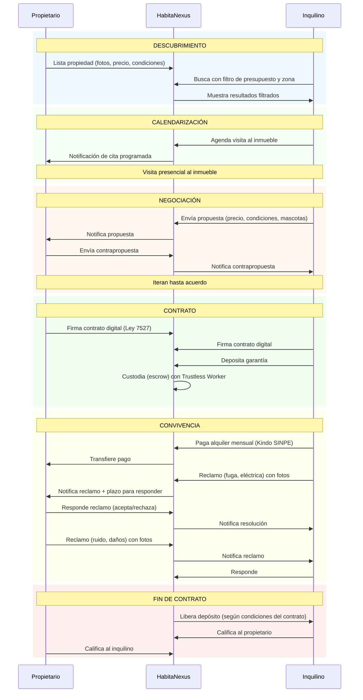
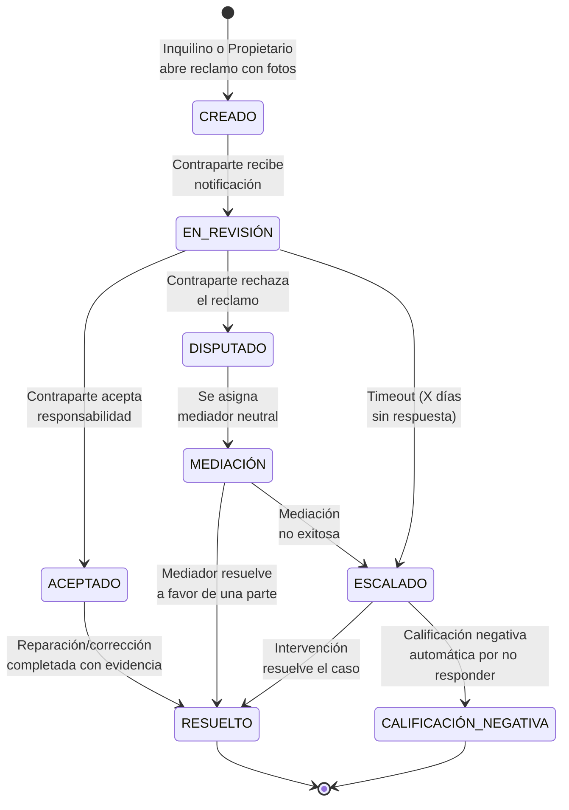

# Cadena de Valor (Value Chain)

> ¿Cómo fluye el valor desde el propietario hasta el inquilino?

## Flujo de Valor Principal

## Máquina de Estados del Reclamo Bidireccional

## Valor Generado por Eslabón

| Eslabón | Valor para el Inquilino | Valor para el Propietario | Valor para HabitaNexus |
|---------|------------------------|--------------------------|----------------------|
| **Listado** | Propiedades filtradas por presupuesto | Inquilinos calificados que realmente pueden pagar | Inventario de la plataforma |
| **Calendarización** | Ahorro de tiempo en visitas | Menos "no-shows" | Activación del usuario |
| **Negociación** | Proceso predecible y respetuoso | Respuestas más rápidas, menos ghosting | Datos de conversión |
| **Contrato** | Seguridad jurídica sin abogado | Protección legal estandarizada | Comisión por transacción |
| **Custodia (Escrow)** | Depósito protegido | Garantía real de que el inquilino pagó | Comisión por procesamiento |
| **Reclamos** | Auditoría del inmueble con evidencia | Documentación de incumplimientos | Retención + diferenciación |
| **Calificación** | Evaluar propietarios antes de alquilar | Historial verificable de inquilinos | Efecto de red + confianza |

---

> 💡 El flujo de reclamos está inspirado en la arquitectura de AltruPets: máquina de estados con auto-escalamiento por timeout, código de seguimiento único, y fotos como evidencia.
