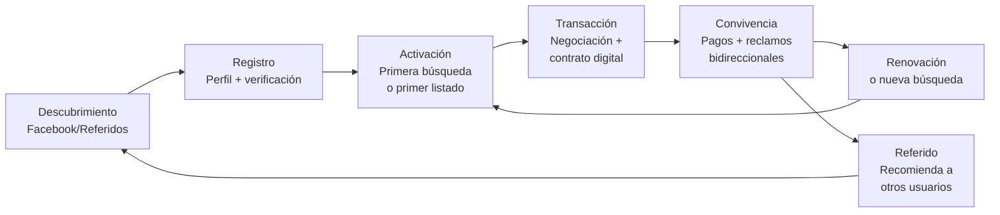

# Relaciones con los Clientes (Customer Relationships)

> ¿Cómo es la relación continua con los usuarios de HabitaNexus?

## Tipo de Relación por Segmento

| Segmento | Tipo de relación | Canal | Frecuencia |
|----------|-----------------|-------|------------|
| **Inquilinos** | Autoservicio + soporte reactivo | App + chat in-app | Desde búsqueda hasta fin de contrato |
| **Propietarios individuales** | Onboarding asistido + autoservicio | App + WhatsApp inicial | Mensual (suscripción) |
| **Administradores** | Soporte dedicado | App + email + llamada | Semanal |

## Ciclo de Vida de la Relación

## Sistema de Reclamos Bidireccional (Relación Post-Contrato)

La funcionalidad que diferencia a HabitaNexus de un marketplace tradicional:

### Reclamos del Inquilino → Propietario
- Fugas de agua
- Fallas en instalación eléctrica / caja de breakers
- Pintura deteriorada
- Problemas en cerámica o pisos
- Plagas o problemas sanitarios
- Cualquier reparación que corresponda al propietario

### Reclamos del Propietario → Inquilino
- Ruido excesivo o molestias a vecinos
- Falta de limpieza o mantenimiento básico
- Daños a la propiedad
- Mascotas no autorizadas en el contrato
- Incumplimiento de condiciones pactadas

### Flujo del Reclamo
1. La parte afectada abre reclamo con **fotos como evidencia** + descripción
2. Sistema genera **código de seguimiento único**
3. La contraparte recibe **notificación** con plazo para responder
4. Si **acepta**: se registra compromiso de reparación/corrección con fecha límite
5. Si **rechaza**: se escala a mediación
6. Si **no responde** (timeout): calificación negativa automática + escalamiento

## Estrategia de Retención

| Acción | Para Inquilinos | Para Propietarios |
|--------|----------------|-------------------|
| **Onboarding** | Tutorial de búsqueda filtrada + calendarización | Tutorial de listado + contrato digital |
| **Engagement** | Alertas de nuevos alquileres en su rango y zona | Dashboard con métricas de ocupación |
| **Retención** | Historial de contratos + calificaciones acumuladas | Renovación automática de suscripción |
| **Reactivación** | "¿Buscando de nuevo?" cuando se acerca fin de contrato | "Tiene propiedades sin listar" |
