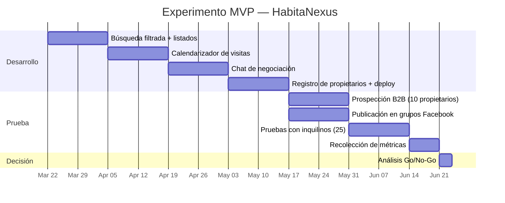

# Diseño de Experimento MVP — HabitaNexus

> Ciclo de validación: Hipótesis → Prototipo → Prueba → Aprendizaje Validado
> Basado en Running Lean (Ash Maurya) y The Lean Product Playbook (Dan Olsen)

**Fecha:** 2026-03-16
**Nombre Iniciativa:** HabitaNexus
**Iteración #:** 1

---

## 1. Hipótesis a Validar

### Hipótesis Técnica

| Campo | Valor |
|-------|-------|
| **Supuesto** | La arquitectura de flutter-agentic-boilerplate (Flutter + NestJS + AKS + ArgoCD) permite implementar un MVP funcional con búsqueda filtrada, calendarización de visitas y negociación digital en menos de 8 semanas de desarrollo (8 horas/domingo) |
| **Criterio de comprobación** | MVP desplegado en staging con las 3 funcionalidades core operativas y testeadas por al menos 5 usuarios |
| **Método de medición** | Release en staging + pruebas de usuario + métricas de tiempo de desarrollo |
| **Plazo de verificación** | 8 semanas (64 horas de desarrollo) |

### Hipótesis Comercial

| Campo | Valor |
|-------|-------|
| **Supuesto** | De una muestra de 10 propietarios del GAM con inmuebles en rango ₡125.000-₡350.000, al menos 5 (50%) aceptarían listar su propiedad en la plataforma con una suscripción de ₡10.000/mes |
| **Criterio de comprobación** | 5 propietarios registrados con al menos 1 propiedad listada cada uno y primera suscripción pagada |
| **Método de medición** | Registros en la plataforma + primer pago de suscripción (ONVO Pay) |
| **Plazo de verificación** | 12 semanas (4 semanas de prospección después del MVP) |

### Hipótesis del Modelo de Negocio

| Campo | Valor |
|-------|-------|
| **Supuesto** | El modelo dual (comisión al inquilino + suscripción al propietario) genera suficiente MRR para cubrir costos de infraestructura (~₡550.000/mes) con menos de 55 propietarios suscritos |
| **Criterio de comprobación** | MRR ≥ ₡100.000 a los 6 meses (camino al punto de equilibrio) |
| **Método de medición** | Dashboard financiero con MRR real vs proyectado |
| **Plazo de verificación** | 6 meses |

---

## 2. Diseño del Prototipo

### Tipo de Prototipo

- [ ] Prototipo de concepto
- [ ] Landing page
- [x] **MVP funcional** — App Flutter con funcionalidades core
- [ ] Wizard of Oz
- [ ] Concierge

### Funcionalidades incluidas en el MVP

| # | Funcionalidad | Hipótesis que valida | Esfuerzo |
|---|--------------|---------------------|----------|
| 1 | **Búsqueda con filtro de presupuesto** (₡min - ₡max) + zona | Comercial: ¿los inquilinos encuentran propiedades en su rango? | M |
| 2 | **Calendarizador de visitas** integrado | Comercial: ¿reduce el esfuerzo físico y el tiempo? | M |
| 3 | **Chat de negociación** con propuesta/contrapropuesta | Comercial: ¿los usuarios prefieren esto vs WhatsApp? | L |
| 4 | **Registro de propietarios** con verificación básica | Comercial: ¿los propietarios se registran y listan? | S |
| 5 | **Listado de propiedades** con fotos, precio, condiciones | Técnica: ¿el sistema soporta la carga de datos? | S |

### Funcionalidades explícitamente EXCLUIDAS del MVP

| # | Funcionalidad | Razón de exclusión |
|---|--------------|-------------------|
| 1 | Contrato digital con firma electrónica | Requiere validación legal con Sfera Legal primero |
| 2 | Custodia (escrow) con Trustless Worker | Requiere integración compleja; validar demanda primero |
| 3 | Sistema de reclamos bidireccional | Requiere que haya contratos activos primero |
| 4 | Procesamiento de pagos de alquiler (Kindo) | Requiere que haya contratos activos primero |
| 5 | Calificación de propietarios/inquilinos | Requiere masa crítica de transacciones |

### Recursos Necesarios

| Recurso | Detalle | Costo estimado |
|---------|---------|---------------|
| Tiempo | 8 semanas × 8 hrs/domingo = 64 horas | $0 (tiempo del fundador) |
| Infraestructura | Azure AKS (staging) vía Microsoft for Startups | $0 (créditos) |
| Boilerplate | flutter-agentic-boilerplate con 54 skills | $0 (ya disponible) |
| Diseño UX | Figma mockups (funcionalidades core) | ₡300.000-₡500.000 |
| **Total** | | **₡300.000-₡500.000** |

---

## 3. Plan de Prueba

### Diseño del Experimento

| Aspecto | Detalle |
|---------|---------|
| **Población objetivo** | Inquilinos buscando alquiler ₡125K-₡350K en GAM + propietarios con inmuebles en ese rango |
| **Tamaño de muestra** | 10 propietarios (B2B) + 25 inquilinos (B2C) |
| **Método de reclutamiento** | Prospección directa en grupos de Facebook de alquileres |
| **Duración del experimento** | 12 semanas (8 desarrollo + 4 prueba) |
| **Métricas principales** | Propietarios registrados, búsquedas completadas, visitas agendadas |
| **Métricas secundarias** | Tiempo promedio de primera búsqueda, tasa de conversión registro → búsqueda |

### Métricas de Éxito — Decisión de Continuar o Pivotar (Go/No-Go)

| Métrica | No-Go (pivotar) | Go (persistir) | Excepcional (escalar) |
|---------|-----------------|-----------------|----------------------|
| Propietarios registrados | < 3 | ≥ 5 | > 8 |
| Inquilinos que completaron 1 búsqueda | < 10 | ≥ 15 | > 20 |
| Visitas agendadas vía calendarizador | < 3 | ≥ 5 | > 10 |
| Chats de negociación iniciados | < 2 | ≥ 3 | > 5 |

### Cronograma del Experimento



---

## 4. Resultados

> Completar DESPUÉS de ejecutar el experimento.

### Datos Recolectados

| Métrica | Resultado | vs Target | Señal |
|---------|----------|-----------|-------|
| Propietarios registrados | `[pendiente]` | ≥ 5 | 🟢 / 🟡 / 🔴 |
| Inquilinos con 1+ búsqueda | `[pendiente]` | ≥ 15 | 🟢 / 🟡 / 🔴 |
| Visitas agendadas | `[pendiente]` | ≥ 5 | 🟢 / 🟡 / 🔴 |
| Chats de negociación | `[pendiente]` | ≥ 3 | 🟢 / 🟡 / 🔴 |

### Evidencia Cualitativa

```
[Citas textuales, observaciones, patrones detectados en las pruebas]
```

---

## 5. Aprendizaje Validado

### ¿Qué aprendimos?

1. `[pendiente — completar después del experimento]`
2. `[pendiente]`
3. `[pendiente]`

### Decisión: Pivotar, Persistir o Abortar

- [ ] **PERSISTIR** — Hipótesis confirmada. Seguir con Espacio 3 (Ejecución).
- [ ] **PIVOTAR** — Hipótesis refutada parcialmente. Cambiar [aspecto específico].
- [ ] **ABORTAR** — Hipótesis refutada completamente.

### Si PIVOTAR: Tipo de Pivote

- [ ] Acercamiento (Zoom-in): Una funcionalidad se convierte en el producto completo
- [ ] Alejamiento (Zoom-out): El producto se convierte en una funcionalidad de algo más grande
- [ ] Segmento de cliente: Mismo producto, diferente segmento
- [ ] Necesidad del cliente: Mismo segmento, diferente problema
- [ ] Plataforma: Cambio de app a plataforma (o viceversa)
- [ ] Arquitectura de negocio: B2B ↔ B2C, margen alto ↔ volumen
- [ ] Canal: Cambio en el canal de distribución
- [ ] Tecnología: Misma solución, diferente tecnología
- [ ] Motor de crecimiento: Cambio en estrategia de adquisición

---

> 💡 **Referencia**: Ciclo de Experimentación — *Running Lean* (Ash Maurya) + *The Lean Product Playbook* (Dan Olsen). Los tipos de pivote son del *Lean Startup* (Eric Ries).
