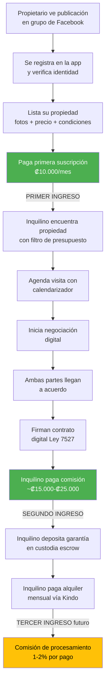

# Modelo de Ingresos (Revenue Model)

> Análisis competitivo de modelos de ingresos + modelo seleccionado para HabitaNexus

## Análisis de Modelos Competitivos

| # | Competidor | Modelo de ingresos | Cómo cobran | Calificación (1-5) | Cómo mejoraríamos |
|---|-----------|-------------------|-------------|--------------------|--------------------|
| 1 | **Encuentra24** | Pago por listado | $19-$40 por anuncio (90-180 días) + destacados premium ($17-$149) | ⭐⭐⭐ (3/5) | Suscripción mensual es más predecible que pago por anuncio; incluir contrato digital |
| 2 | **Coldwell Banker CR** | Comisión por transacción + gestión | 5-8% venta + 13% IVA; ~8% alquiler mensual como gestión | ⭐⭐ (2/5) | Demasiado caro para alquileres accesibles; no incluye tecnología de autoservicio |
| 3 | **RE/MAX CR** | Comisión por transacción | 5-8% venta + 13% IVA; ~1 mes de renta como comisión de intermediación | ⭐⭐ (2/5) | Enfocado en lujo; cobrar 1 mes de renta es prohibitivo para ₡125K-₡350K |
| 4 | **NATIVU** | Comisión por transacción | 5-10% venta + 13% IVA | ⭐⭐ (2/5) | Comisiones altas; sin herramientas de autoservicio para el propietario |
| 5 | **Facebook** | Gratis (publicidad opcional) | $0 listado; $5+/día para boost | ⭐⭐⭐⭐ (4/5) | Modelo freemium con valor agregado (contrato, escrow, reclamos) justifica cobrar |
| 6 | **Airbnb** | Comisión por reserva | 15.5% al anfitrión por cada reserva | ⭐⭐ (2/5) | 15.5% es excesivo para alquiler a largo plazo; modelo no diseñado para contratos 6+ meses |
| 7 | **FazWaz CR** | Comisión por éxito | 3-5% + IVA solo al cerrar venta | ⭐⭐⭐ (3/5) | Bueno para ventas pero no tiene modelo para alquileres recurrentes |
| 8 | **Alien Realty** | SaaS (estimado) | Suscripción para inmobiliarias (precio no público) | ⭐⭐⭐ (3/5) | No enfocado en alquiler; sin contrato digital ni escrow |

## Tres Modelos Evaluados

### Modelo A: Solo comisión por transacción (al inquilino)
- **Pros**: Sin barrera de entrada para propietarios; el inquilino paga solo cuando cierra
- **Contras**: Ingreso no recurrente; depende de volumen de transacciones; propietarios no tienen incentivo a mantener listados actualizados
- **Precio**: ~₡20.000 por contrato firmado (~5-8% del primer mes)
- **Clientes necesarios para ₡550K/mes**: ~28 contratos/mes (inalcanzable al inicio)

### Modelo B: Solo suscripción mensual (al propietario) ★ MÁS SIMPLE
- **Pros**: Ingreso recurrente predecible (MRR); propietarios mantienen listados activos
- **Contras**: Barrera de entrada para propietarios; necesita demostrar valor antes de cobrar
- **Precio**: ₡10.000-₡30.000/mes según plan
- **Clientes necesarios para ₡550K/mes**: ~25-55 propietarios

### Modelo C: Dual — comisión al inquilino + suscripción al propietario ★ SELECCIONADO
- **Pros**: Dos flujos de ingreso; balancea recurrente con transaccional; cada lado paga por lo que más valora
- **Contras**: Más complejo de implementar; riesgo de que inquilinos eviten la comisión contactando por fuera
- **Precio inquilino**: ~₡15.000-₡25.000 por contrato
- **Precio propietario**: ₡10.000-₡30.000/mes
- **Clientes necesarios para ₡550K/mes**: ~15-30 propietarios + 5-10 contratos/mes

## Modelo Seleccionado: Dual (Modelo C)

Justificación: Combina la previsibilidad del SaaS (propietarios) con el ingreso por transacción (inquilinos). Cada lado paga por el valor que recibe:
- El propietario paga por tener su propiedad visible, verificada y con herramientas de gestión
- El inquilino paga por la seguridad jurídica del contrato digital y la protección del depósito

## Pasos hacia el Ingreso (Steps to Revenue)

## Entrevistas de Ingresos (Revenue Interviews) — Por ejecutar

| # | Cliente | Modelo presentado | Precio aceptable | Valor de Vida (LTV — Lifetime Value) estimado |
|---|---------|-----------------|-----------------|-----------------------------------------------|
| 1 | `[Pendiente — primer propietario B2B]` | Suscripción ₡10.000/mes | `[por validar]` | `[por calcular]` |
| 2 | `[Pendiente — primer inquilino]` | Comisión ₡20.000 por contrato | `[por validar]` | `[por calcular]` |
