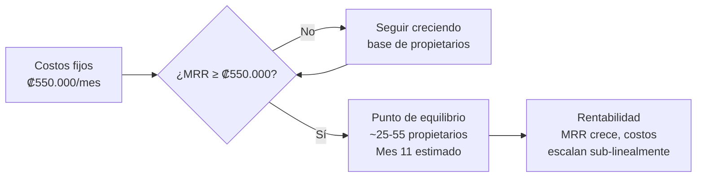

# Modelo Financiero (Financial Model) — 18 Meses

## Proyección de Ingresos

| Mes | Propietarios suscritos | MRR suscripciones | Contratos firmados (acum.) | Ingresos comisiones (mes) | MRR total |
|-----|----------------------|-------------------|--------------------------|--------------------------|-----------|
| 1 | 2 | ₡20.000 | 0 | ₡0 | ₡20.000 |
| 2 | 4 | ₡40.000 | 0 | ₡0 | ₡40.000 |
| 3 | 7 | ₡70.000 | 1 | ₡20.000 | ₡90.000 |
| 4 | 10 | ₡100.000 | 2 | ₡20.000 | ₡120.000 |
| 5 | 13 | ₡150.000 | 3 | ₡20.000 | ₡170.000 |
| 6 | 17 | ₡210.000 | 5 | ₡40.000 | ₡250.000 |
| 7 | 20 | ₡250.000 | 7 | ₡40.000 | ₡290.000 |
| 8 | 24 | ₡300.000 | 10 | ₡60.000 | ₡360.000 |
| 9 | 28 | ₡350.000 | 13 | ₡60.000 | ₡410.000 |
| 10 | 32 | ₡400.000 | 17 | ₡80.000 | ₡480.000 |
| 11 | 37 | ₡460.000 | 21 | ₡80.000 | ₡540.000 |
| **12** | **42** | **₡520.000** | **26** | **₡100.000** | **₡620.000** |
| 13 | 48 | ₡600.000 | 32 | ₡120.000 | ₡720.000 |
| 14 | 54 | ₡680.000 | 39 | ₡140.000 | ₡820.000 |
| 15 | 60 | ₡750.000 | 47 | ₡160.000 | ₡910.000 |
| 16 | 67 | ₡840.000 | 56 | ₡180.000 | ₡1.020.000 |
| 17 | 74 | ₡930.000 | 66 | ₡200.000 | ₡1.130.000 |
| **18** | **82** | **₡1.030.000** | **77** | **₡220.000** | **₡1.250.000** |

## Estructura de Costos

### Costos Fijos

| Concepto | Mensual | Notas |
|----------|---------|-------|
| Infraestructura cloud (Azure AKS staging + prod) | ₡530.000 (~$1.086) | Primeros 5 meses cubiertos por Microsoft for Startups ($5.000) |
| Dominio + DNS | ₡5.000 | .com + .cr |
| Herramientas (GitHub, Figma) | ₡15.000 | GitHub gratis con MS for Startups |
| **Total fijo** | **₡550.000** | |

### Costos Variables

| Concepto | Costo unitario |
|----------|---------------|
| Procesamiento de pagos (Kindo/ONVO) | 1-3% por transacción |
| Verificación de propietarios | ~₡2.000/verificación |
| Marketing (cuando sea necesario) | ₡50.000-₡200.000/mes |

## Supervivencia de Lanzamiento (Launch Survival)

| Métrica | Valor |
|---------|-------|
| **Fuente de financiamiento** | Autofinanciamiento (Bootstrapping — recursos propios sin inversores) |
| **Dedicación** | 8 horas/domingo (empleo full-time entre semana) |
| **Inversión inicial estimada** | ₡800.000-₡2.300.000 (validación legal + diseño UX) |
| **Costos fijos mensuales** | ₡550.000 (post-créditos cloud) |
| **Meses cubiertos por créditos cloud** | ~5 meses (Microsoft for Startups $5.000) |
| **Runway personal** | Indefinido — salario cubre gastos personales; HabitaNexus se financia con ingreso de suscripciones |

## Punto de Equilibrio (Break-Even)

| Escenario | Propietarios necesarios | Mes estimado |
|-----------|------------------------|-------------|
| Solo suscripciones (₡10K/mes promedio) | 55 | Mes 13 |
| Dual: suscripciones + comisiones | **~35** | **Mes 11** |
| Optimista: suscripciones + comisiones + procesamiento pagos | ~25 | Mes 9 |

## Levantamiento de Capital (si necesario en el futuro)

| Ronda | Monto | Fuente | Uso |
|-------|-------|--------|-----|
| **Actual** | $0 | Autofinanciamiento (Bootstrapping) | Tiempo del fundador |
| **Créditos cloud** | $5.000 | Microsoft for Startups Founders Hub | Infraestructura Azure 5 meses |
| **Pre-seed (futuro)** | $5.000-$15.000 | Familia y amigos / premio de incubadora | Validación legal + diseño + marketing inicial |
| **Seed (futuro)** | $25.000-$100.000 | Ángeles inversores / aceleradora | Equipo + crecimiento + integración escrow |
