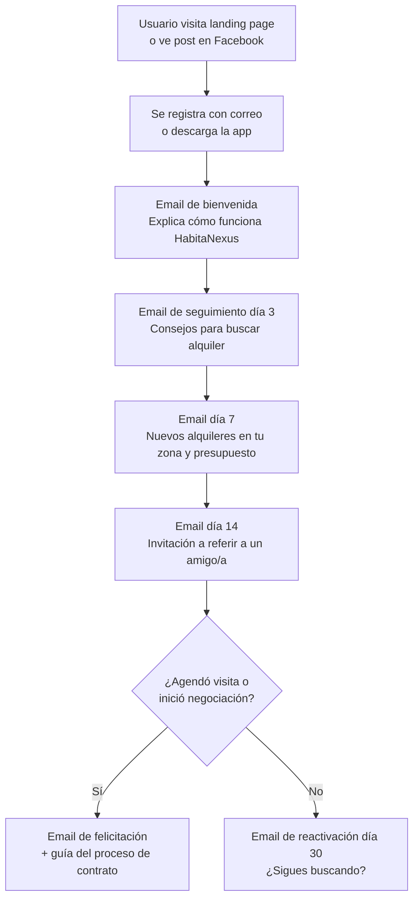

# Salida al Mercado (Go-to-Market)

> Canales, mensajes, herramientas y metas de crecimiento

## Mensajes de Marketing (≤140 caracteres)

| # | Mensaje | Enfoque |
|---|---------|---------|
| 1 | "¿Cansado/a de buscar alquiler en 25 grupos de Facebook? Filtrá por tu presupuesto real en HabitaNexus." | Dolor → solución |
| 2 | "Firmá contrato de alquiler digital sin abogado. Tu depósito protegido. HabitaNexus." | Seguridad jurídica |
| 3 | "Propietario: listá tu alquiler y olvidate de WhatsApp. HabitaNexus gestiona todo." | Lado B2B |

## Canales de Adquisición de Clientes

| Canal | Tipo | Costo | Efectividad estimada | Prioridad |
|-------|------|-------|---------------------|-----------|
| Grupos de Facebook de alquileres CR | Orgánico | ₡0 | Alta — ahí están los clientes | 🔴 1 |
| Referidos de usuarios satisfechos | Orgánico | ₡0-₡5.000/referido | Alta — boca a boca | 🔴 1 |
| Prospección directa B2B (propietarios) | Directo | Tiempo del fundador | Alta — contacto 1-a-1 | 🔴 1 |
| Instagram — contenido educativo sobre derechos del inquilino | Orgánico | ₡0 | Media | 🟡 2 |
| TikTok — videos cortos mostrando el dolor de buscar alquiler | Orgánico | ₡0 | Media | 🟡 2 |
| Facebook Ads segmentados por GAM + intereses | Pagado | ₡50.000-₡200.000/mes | Media | 🟢 3 |
| SEO — "alquileres baratos Heredia", "alquiler San José ₡200.000" | Orgánico | ₡0 | Baja al inicio, alta a largo plazo | 🟢 3 |

## Flujo de Captura de Correos Electrónicos (Email Capture)

## Metas de Crecimiento (Growth Goals)

### Durante el programa (primeras 12 semanas)

| Semana | Meta lado oferta (propietarios) | Meta lado demanda (inquilinos) |
|--------|-------------------------------|-------------------------------|
| 1-2 | 2 propietarios contactados | Landing page lista |
| 3-4 | 5 propietarios registrados | 10 registros de inquilinos |
| 5-6 | 7 propietarios con propiedades listadas | 25 registros; 10 búsquedas completadas |
| 7-8 | 8 propietarios activos | 5 visitas agendadas |
| 9-10 | 10 propietarios; 5 con suscripción | 3 negociaciones iniciadas |
| 11-12 | 10 propietarios estables | 1 contrato firmado (meta de la Puerta 2) |

### Después del programa (metas mensuales)

| Mes | Propietarios | Inquilinos activos | Contratos acumulados |
|-----|-------------|-------------------|---------------------|
| 6 | 17 | 100 | 5 |
| 9 | 28 | 200 | 13 |
| 12 | 42 | 400 | 26 |
| 18 | 82 | 1.000 | 77 |

## Plan de Crecimiento (Growth Plan)

- **Herramientas de seguimiento**: Panel de métricas interno + hoja de cálculo de OKR semanales
- **Responsable de rendición de cuentas (Accountability Partner)**: Por definir (mentor, asesor, o cofundador)
- **Cadencia de revisión**: Semanal (domingos, parte de las 8 horas dedicadas)
- **Acciones correctivas si no se cumplen las metas**: Pivotar canal de adquisición, ajustar mensaje, cambiar segmento B2B objetivo
