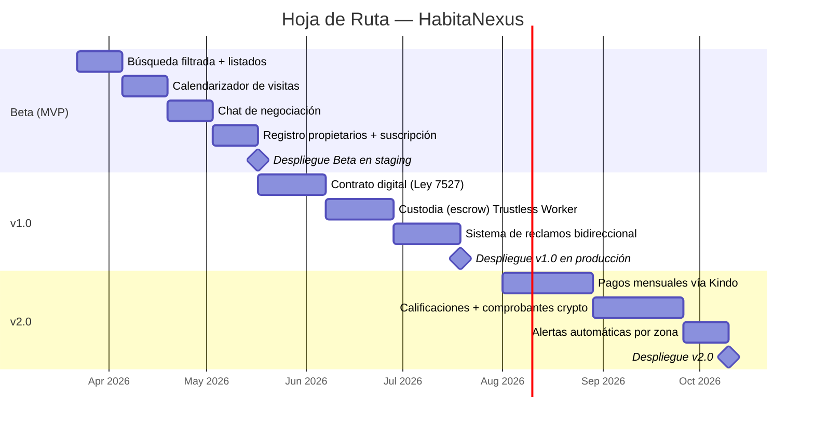

# Hoja de Ruta del Producto (Product Roadmap)

> Funcionalidades, lanzamientos y plan de proyecto

## Metas de la Solución (Solution Goals) — Próximo Año

| # | Meta | Métrica | Target |
|---|------|---------|--------|
| 1 | Reducir el tiempo de búsqueda de alquiler | Días desde primera búsqueda hasta contrato firmado | De ~60 días a <7 días |
| 2 | Estandarizar la negociación de contratos de alquiler | % de contratos firmados digitalmente vs informales | >80% de transacciones en la plataforma |
| 3 | Proteger a los inquilinos contra abusos post-contrato | Reclamos resueltos exitosamente / reclamos totales | >70% tasa de resolución |

## Mapa de Funcionalidades (Feature Map)

| Grupo | Funcionalidad | Prioridad | Lanzamiento (Release) |
|-------|--------------|-----------|----------------------|
| **Búsqueda** | Filtro por rango de presupuesto (₡min - ₡max) | 1 (esencial) | Beta |
| **Búsqueda** | Filtro por zona / provincia / cantón | 1 (esencial) | Beta |
| **Búsqueda** | Listado de propiedades con fotos y condiciones | 1 (esencial) | Beta |
| **Búsqueda** | Alertas de nuevos alquileres en rango y zona | 2 (siguiente) | v1.0 |
| **Visitas** | Calendarizador de citas de visita al inmueble | 1 (esencial) | Beta |
| **Negociación** | Chat de negociación con propuesta/contrapropuesta | 1 (esencial) | Beta |
| **Propietario** | Registro con verificación de identidad | 1 (esencial) | Beta |
| **Propietario** | Panel de gestión de propiedades listadas | 1 (esencial) | Beta |
| **Propietario** | Suscripción mensual (ONVO Pay) | 1 (esencial) | Beta |
| **Contrato** | Firma digital con plantillas legales (Ley 7527) | 1 (esencial) | v1.0 |
| **Contrato** | Comisión al inquilino por contrato firmado | 2 (siguiente) | v1.0 |
| **Pagos** | Custodia (escrow) del depósito con Trustless Worker | 2 (siguiente) | v1.0 |
| **Pagos** | Pago mensual de alquiler vía Kindo (SINPE) | 3 (deseable) | v2.0 |
| **Reclamos** | Sistema bidireccional con fotos + escalamiento | 2 (siguiente) | v1.0 |
| **Confianza** | Calificación de propietarios e inquilinos | 3 (deseable) | v2.0 |
| **Confianza** | Aceptación de comprobantes no tradicionales (facturas, stablecoins) | 3 (deseable) | v2.0 |

## Plan de Lanzamientos (Release Plan)

## Equipo del Proyecto (Project Team)

| Rol | Persona | Habilidades | Compensación |
|-----|---------|-------------|-------------|
| CTO / Desarrollador Full-Stack | Andrés Peña Castillo | Flutter, NestJS, Kubernetes, SRE, arquitectura cloud | 8 hrs/domingo (equity 100%) |
| Diseñador UX/UI | Por contratar (freelancer) | Figma, diseño mobile, UX research | ₡300.000-₡500.000 (proyecto) |
| Asesoría legal | Sfera Legal | Derecho de arrendamientos, PI, corporativo | ₡500.000-₡1.500.000 (proyecto) |

## Herramientas de Desarrollo

| Categoría | Herramienta | Costo |
|-----------|------------|-------|
| Frontend móvil | Flutter + Dart | Gratis |
| Backend | NestJS (arquitectura hexagonal) | Gratis |
| Infraestructura | Azure AKS + Terraform + ArgoCD | $5.000 créditos MS for Startups |
| Base de datos | PostgreSQL + PostGIS | Incluido en Azure |
| CI/CD | GitHub Actions | Gratis |
| Diseño | Figma | Gratis (plan starter) |
| Boilerplate | flutter-agentic-boilerplate (54 skills AI) | Gratis (propio) |
| Gestión de proyecto | Linear | Gratis (plan starter) |
