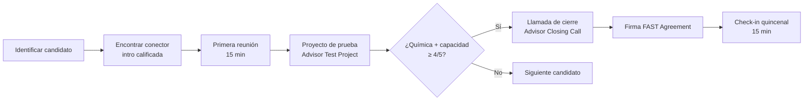

# Junta Asesora (Advisory Board)

> Identificación de asesores en 3 categorías + acuerdo de compensación

## Lista de Asesores Objetivo (Advisor Target List)

Se necesitan 3 asesores en 3 categorías:

### Categoría 1: Startup (fundador/a con salida exitosa — exit)

| # | Nombre | Título | Empresa | Conector | Estado |
|---|--------|--------|---------|----------|--------|
| 1 | `[Por identificar]` | Fundador/a con exit en proptech o marketplace | — | — | 🔴 Pendiente |
| 2 | `[Por identificar]` | Fundador/a de startup costarricense escalada | — | — | 🔴 Pendiente |
| 3 | `[Por identificar]` | Mentor/a de incubadora con experiencia en marketplaces bilaterales | — | — | 🔴 Pendiente |

### Categoría 2: Industria (experto en el dominio inmobiliario/legal)

| # | Nombre | Título | Empresa | Conector | Estado |
|---|--------|--------|---------|----------|--------|
| 1 | `[Por identificar]` | Abogado/a especialista en derecho de arrendamientos CR | Sfera Legal u otro | — | 🔴 Pendiente |
| 2 | `[Por identificar]` | Agente inmobiliario con experiencia en alquileres GAM | — | — | 🔴 Pendiente |
| 3 | `[Por identificar]` | Administrador/a de propiedades con 10+ unidades | — | — | 🔴 Pendiente |

### Categoría 3: Tecnología / Marketing

| # | Nombre | Título | Empresa | Conector | Estado |
|---|--------|--------|---------|----------|--------|
| 1 | `[Por identificar]` | CTO o VP Engineering con experiencia en apps Flutter a escala | — | — | 🔴 Pendiente |
| 2 | `[Por identificar]` | Growth marketer con experiencia en marketplaces LATAM | — | — | 🔴 Pendiente |
| 3 | `[Por identificar]` | Especialista en pagos digitales / fintech CR | — | — | 🔴 Pendiente |

## Proceso de Selección de Asesores

## Acuerdo de Compensación — FAST (Founder Advisor Standard Template)

| Campo | Valor |
|-------|-------|
| **Tipo de acuerdo** | FAST Agreement (Founder Institute) |
| **Participación por asesor** | 0.25% - 1.0% (según nivel de involucramiento) |
| **Período de prueba (Cliff)** | 3 meses — si la relación falla, el acuerdo se cancela |
| **Período de adquisición (Vesting)** | 24 meses con cliff de 3 meses |
| **Cadencia de reuniones** | Quincenal, 15 minutos mínimo |

## Reunión Inaugural de la Junta Asesora

| Campo | Valor |
|-------|-------|
| **Fecha objetivo** | Cuando se tengan 3 asesores confirmados (estimado: Mes 6-9) |
| **Formato** | Videollamada de 1 hora |
| **Agenda** | Presentación del progreso, métricas AARRR, desafíos principales, asks del fundador |
| **Frecuencia posterior** | Trimestral |

---

> 💡 La junta asesora es especialmente crítica para HabitaNexus por la necesidad de expertise legal (contratos de arrendamiento) y fintech (escrow/pagos). Priorizar la categoría de Industria primero — un abogado especialista en arrendamientos puede desbloquear la validación de las plantillas de contrato.
